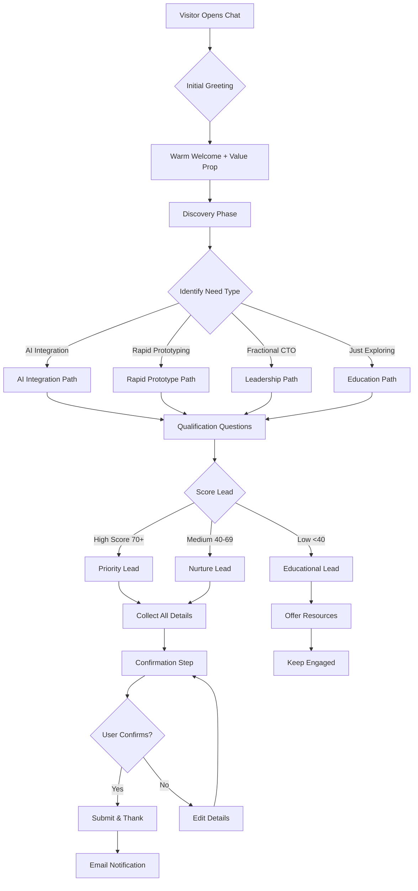

# AI Agent Lead Qualification Workflow

## Visual Flow Overview



## Detailed Conversation Workflow

### 🎯 Phase 1: Opening (0-30 seconds)
**Goal:** Warm greeting, establish purpose, create engagement

```
Agent: "Welcome to Amplifyx Technologies! I'm here to help you explore how 
we can accelerate your product development with AI. What brings you here today?"

Quick Actions:
• Need AI integration
• Rapid prototyping  
• Fractional CTO services
• Just exploring
```

**Key Behaviors:**
- Be enthusiastic but professional
- Immediately show value proposition
- Provide quick action buttons for common paths

---

### 🔍 Phase 2: Discovery (30s - 2 min)
**Goal:** Understand their challenge and urgency

#### Path A: AI Integration Interest
```
Visitor: "I need AI integration"
Agent: "Excellent! AI can transform your product capabilities. Are you looking 
to add AI to an existing product, or building something new from scratch?"

Follow-ups:
- What industry/domain?
- Current tech stack?
- Specific AI capabilities needed? (NLP, vision, predictive, etc.)
```

#### Path B: Rapid Prototyping
```
Visitor: "Need rapid prototyping"
Agent: "Great! We specialize in shipping MVPs in weeks, not quarters. 
What's the core concept you want to validate?"

Follow-ups:
- Target users?
- Key features for MVP?
- Competition/market validation?
```

#### Path C: Fractional CTO
```
Visitor: "Fractional CTO services"
Agent: "Smart move! Our fractional CTO services provide senior technical 
leadership at a fraction of the cost. What's your current team size and 
biggest technical challenge?"

Follow-ups:
- Current team structure?
- Technical debt or scaling issues?
- Strategic planning needs?
```

#### Path D: Just Exploring
```
Visitor: "Just exploring"
Agent: "Perfect! Let me share how we're helping companies ship AI-powered 
products 10x faster. What's your role and what caught your interest about 
Amplifyx?"

Follow-ups:
- Current role/company?
- Pain points with current development?
- Interest in AI transformation?
```

---

### 📊 Phase 3: Qualification (2-4 min)
**Goal:** Gather key qualifying information naturally

**Priority Information to Collect:**
1. **Contact Details** (Required)
   - Name: "By the way, I'm Alex from Amplifyx. Who am I speaking with?"
   - Email: "What's the best email to send you a detailed proposal?"
   - Company: "Which company are you with?"

2. **Project Scope** (Important)
   - Timeline: "When are you looking to get started?"
   - Budget: "To ensure we propose the right solution, what budget range are you working with?"
   - Decision process: "Are you the decision maker, or who else is involved?"

3. **Technical Details** (Valuable)
   - Current stack
   - Team size
   - Specific requirements

**Natural Extraction Techniques:**
```javascript
// Instead of: "What's your budget?"
// Use: "We have solutions from proof-of-concepts starting at $10k to 
// full implementations at $100k+. What range works for your initiative?"

// Instead of: "What's your email?"
// Use: "I can send you our case studies and a custom proposal. 
// What's the best email to reach you?"

// Instead of: "What's your timeline?"
// Use: "Are you looking to start this quarter, or planning for next year?"
```

---

### ✅ Phase 4: Confirmation (4-5 min)
**Goal:** Verify information and create commitment

```
Agent: "Perfect! Let me confirm what I've captured:

📝 **Your Details:**
• Name: [Name]
• Company: [Company]
• Email: [Email]

🚀 **Your Project:**
• Need: [Project Type]
• Timeline: [Timeline]
• Budget Range: [Budget]

Is everything correct?"

[Yes, looks good!] [Let me update something]
```

---

### 🎉 Phase 5: Closing (5+ min)
**Goal:** Set expectations and maintain engagement

#### High-Value Lead (Score 70+)
```
Agent: "Excellent! Your project aligns perfectly with our expertise. 
Reference #[AMP-XXXXX]

Adrian will personally reach out within 24 hours with:
• Custom proposal for your [specific need]
• Relevant case studies
• Potential quick wins we've identified

Meanwhile, would you like to see how we helped [similar company] achieve [result]?"
```

#### Medium-Value Lead (Score 40-69)
```
Agent: "Great! I've captured your requirements. Reference #[AMP-XXXXX]

Our team will review your needs and send you:
• Tailored recommendations
• Relevant case studies
• Potential approach options

Expect to hear from us within 48 hours. Any specific questions before we connect?"
```

#### Low-Value Lead (Score <40)
```
Agent: "Thanks for exploring Amplifyx! While you're in the early stages, 
here are some resources that might help:
• Our AI Integration Guide
• Case studies in your industry
• Free consultation when you're ready

What specific information would be most helpful for you right now?"
```

---

## Lead Scoring Matrix

| Factor | Points | Criteria |
|--------|--------|----------|
| **Timeline** | | |
| ASAP/This month | 30 | Ready to start immediately |
| 1-3 months | 20 | Active planning phase |
| 3-6 months | 10 | Future planning |
| Just researching | 5 | Early stage |
| **Budget** | | |
| $100k+ | 30 | Enterprise project |
| $50k-$100k | 25 | Substantial project |
| $25k-$50k | 20 | Standard project |
| $10k-$25k | 15 | Small project |
| Unknown | 5 | Needs education |
| **Contact Quality** | | |
| Full details + decision maker | 20 | High quality |
| Full details | 15 | Good quality |
| Email only | 10 | Basic quality |
| **Engagement** | | |
| Specific technical questions | 20 | High intent |
| General interest | 10 | Medium intent |
| Just browsing | 5 | Low intent |

**Score Interpretation:**
- **70+ Points**: 🔥 Hot Lead - Immediate follow-up
- **40-69 Points**: 🌡️ Warm Lead - Nurture within 48h
- **<40 Points**: ❄️ Cold Lead - Educational track

---

## Conversation Guard Rails

### ✅ ALWAYS Stay On Topic
```javascript
// If asked about unrelated topics:
if (isOffTopic(message)) {
  return "That's interesting! However, I'm specifically here to help you 
  explore how Amplifyx can accelerate your product development with AI. 
  What aspect of AI integration interests you most?";
}
```

### ✅ Handle Objections
```javascript
// Price objection:
"I understand budget is important. Our ROI typically shows 10x return within 
6 months. We also offer proof-of-concepts starting at $10k to demonstrate value."

// Timeline objection:
"No rush! When you're ready, we'll be here. Meanwhile, can I send you our 
case study on how [similar company] saved 3 months using our approach?"

// Competitor comparison:
"Great question! Unlike traditional consultancies, we specialize in rapid 
AI implementation with onshore talent at fractional cost. Our clients ship 
in weeks, not quarters."
```

### ✅ Maintain Professionalism
```javascript
// Never discuss:
- Personal topics unrelated to business
- Competitors negatively  
- Specific client names without permission
- Pricing below minimum thresholds
- Technical details beyond scope
```

---

## Example Optimal Conversation

```
Bot: Welcome to Amplifyx Technologies! I'm here to help you explore how we 
can accelerate your product development with AI. What brings you here today?

Visitor: We need to add AI to our SaaS platform

Bot: Excellent decision! AI can significantly enhance your SaaS platform's 
capabilities. Are you looking to add predictive analytics, natural language 
processing, or perhaps intelligent automation features?

Visitor: We want to add a chatbot like yours to help with customer support

Bot: Perfect! An AI-powered support chatbot can reduce support tickets by 
60-70% while improving customer satisfaction. How large is your current 
customer base, and what's your average support ticket volume?

Visitor: About 5000 customers, maybe 200 tickets per day

Bot: That's substantial volume - great opportunity for automation! We've 
helped similar SaaS companies reduce that to under 50 human-handled tickets 
daily. By the way, I'm working with Alex from our team. What's your name?

Visitor: I'm Sarah from TechCorp

Bot: Nice to meet you, Sarah! With 200 daily tickets, you're probably 
spending $300K+ annually on support. Our solution typically pays for itself 
in 3-4 months. When are you hoping to have this implemented?

Visitor: ASAP, ideally this quarter

Bot: Great urgency! We can definitely deliver within this quarter. Our rapid 
implementation starts with a 2-week proof of concept, then full deployment 
in 4-6 weeks. To propose the right solution, what budget range are you 
working with? Our chatbot implementations typically range from $25K for 
basic to $75K for advanced with full integration.

Visitor: We have about $50K allocated

Bot: Perfect! That's right in our sweet spot for a comprehensive solution 
with your existing platform integration. What's the best email to send you 
a detailed proposal with timeline and ROI projections?

Visitor: sarah@techcorp.com

Bot: Excellent! Let me confirm what I've captured:

📝 Your Details:
• Name: Sarah
• Company: TechCorp  
• Email: sarah@techcorp.com

🚀 Your Project:
• Need: AI Support Chatbot for SaaS
• Volume: 200 tickets/day, 5000 customers
• Timeline: This quarter (ASAP)
• Budget Range: ~$50K

Is everything correct?

Visitor: Yes perfect!

Bot: 🎉 Fantastic, Sarah! Your project is high-priority. Reference: #AMP-7X9M2

Adrian, our CEO, will personally reach out within 24 hours with:
• Custom chatbot implementation proposal
• ROI projections based on your ticket volume
• Case study from a similar SaaS integration
• Quick-win opportunities we've identified

Meanwhile, would you like to see a demo of how our chatbot reduced 
TicketMaster Pro's support load by 65%?
```

---

## Implementation Checklist

- [ ] Greeting within 1 second of chat open
- [ ] Value proposition in first message
- [ ] Quick action buttons provided
- [ ] Natural conversation flow (not interrogation)
- [ ] Progressive information gathering
- [ ] Confirmation before submission
- [ ] Clear next steps provided
- [ ] Reference number generated
- [ ] Follow-up expectations set
- [ ] Engagement maintained after submission

## Success Metrics

1. **Conversation Metrics**
   - Average conversation time: 3-5 minutes
   - Lead score: Aim for 40+ average
   - Completion rate: >60%
   - Confirmation rate: >80%

2. **Quality Metrics**
   - Email capture rate: >70%
   - Full details rate: >50%
   - Qualified lead rate: >30%
   - Follow-up engagement: >40%

3. **Behavioral Metrics**
   - On-topic rate: >95%
   - Professional tone: 100%
   - Value communication: Every conversation
   - Next steps clarity: 100%